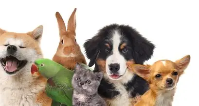

# Pet Adoption Prediction – Stanford Pre-Collegiate ML Final Project

<p align="center">
  
</p>

<p align="center">
  A high-school machine learning project completed during the
  <strong>Stanford Pre-Collegiate Summer Institutes</strong> course
  <em>Introduction to Machine Learning</em>.
</p>

## Overview

This project explores a simple but meaningful question:

**Can we predict whether a shelter pet is likely to be adopted based on its characteristics?**

Using a structured pet adoption dataset, I built and compared several binary classification models, evaluated their performance, and summarized the results in both a notebook and a research poster.

This repository is best viewed as an academic snapshot of early ML work: it shows my thought process, experimentation, and presentation style from when I was still in high school.

## Project Highlights

- Built a complete end-to-end classification workflow in Python and Jupyter.
- Cleaned and prepared a dataset with **2,007 rows** and **13 original columns**.
- Compared multiple models, including decision trees, random forests, and bagging classifiers.
- Tuned models with `GridSearchCV`.
- Evaluated results using accuracy, recall, precision, F1 score, and confusion matrices.
- Created a research poster and supporting presentation materials for the final Stanford course project.

## Main Result

The notebook compares several models and lands on the **tuned decision tree** as the best overall balance between performance and overfitting.

Selected test-set results from the notebook:

| Model | Test Accuracy | Test Recall | Test Precision | Test F1 |
| --- | ---: | ---: | ---: | ---: |
| Decision Tree | 0.887 | 0.828 | 0.828 | 0.828 |
| Tuned Decision Tree | 0.935 | 0.879 | 0.921 | 0.899 |
| Random Forest | 0.942 | 0.874 | 0.945 | 0.908 |
| Bagging Classifier | 0.930 | 0.843 | 0.938 | 0.888 |
| Tuned Bagging Classifier | 0.940 | 0.869 | 0.945 | 0.905 |

Why the tuned decision tree stands out here:

- It performs strongly on the test set.
- It avoids the heavy overfitting visible in some untuned models.
- It remains relatively interpretable, which is especially valuable for a student research project.

## Dataset

The analysis uses `pet_adoption_data.csv`, which contains shelter-style pet records with features such as:

- `PetType`
- `Breed`
- `AgeMonths`
- `Color`
- `Size`
- `WeightKg`
- `Vaccinated`
- `HealthCondition`
- `TimeInShelterDays`
- `AdoptionFee`
- `PreviousOwner`
- `AdoptionLikelihood` (target)

Quick snapshot:

- Total rows: **2,007**
- Target distribution:
  - `0` = 1,348
  - `1` = 659
- Pet types are fairly balanced across dogs, cats, rabbits, and birds.

The dataset source referenced in the project materials is:

- [Kaggle: Predict Pet Adoption Status Dataset](https://www.kaggle.com/datasets/rabieelkharoua/predict-pet-adoption-status-dataset)

## What the Notebook Does

The notebook in [`PetAdoption.ipynb`](./PetAdoption.ipynb) walks through the full workflow:

1. Loads and inspects the dataset.
2. Removes `PetID` because it does not contribute predictive value.
3. Prepares categorical and numeric features.
4. Splits the data into training and test sets.
5. Trains baseline and tuned models.
6. Compares model performance.
7. Examines feature importance for interpretation.

The most important features reported by the tuned decision tree include:

- `Size_Medium`
- `AgeMonths`
- `Vaccinated_1`
- `HealthCondition_1`
- `Breed_Labrador`

## Repository Contents

- [`PetAdoption.ipynb`](./PetAdoption.ipynb) - main Jupyter notebook with the full analysis
- [`PetAdoption.html`](./PetAdoption.html) - exported HTML version of the notebook
- [`pet_adoption_data.csv`](./pet_adoption_data.csv) - dataset used in the project
- [`Dolineaschi Tudor Research Poster.pptx`](./Dolineaschi%20Tudor%20Research%20Poster.pptx) - final research poster
- [`TudorDolineaschi.pdf`](./TudorDolineaschi.pdf) - Stanford certificate of completion
- [`TudoDolineaschir.pdf`](./TudoDolineaschir.pdf) - Stanford instructor evaluation letter
- [`assets/`](./assets/) - README images

## How to Run

You can explore the project in three easy ways:

### Option 1: Read the notebook export

Open [`PetAdoption.html`](./PetAdoption.html) in a browser.

### Option 2: Run the notebook

Install the main libraries used in the notebook:

```bash
pip install pandas numpy seaborn matplotlib scipy statsmodels scikit-learn jupyter
```

Then launch Jupyter:

```bash
jupyter notebook
```

and open `PetAdoption.ipynb`.

### Option 3: View the presentation materials

Open the poster and PDF files to see how the project was presented academically.

## Context

This project was completed as part of the **2024 Stanford Pre-Collegiate Summer Institutes** course **Introduction to Machine Learning**, completed on **June 28, 2024**.

The included certificate and instructor letter provide context for the academic setting in which this work was created. They also reflect the original purpose of the repository: not just to train models, but to learn how to structure a machine learning investigation and communicate the results clearly.

## Limitations

Because this was an early academic project, there are a few natural limitations:

- The repository does not yet include a pinned `requirements.txt` or environment file.
- The code is organized as a notebook rather than a reusable Python package.
- The dataset appears moderately imbalanced, which affects model interpretation.
- Some conclusions are educational and presentation-driven rather than production-grade research claims.

## Why This Project Matters to Me

This repository captures an important stage in my development: learning how to move from curiosity, to data analysis, to model evaluation, to a final presentation. Even though it was built while I was still in high school, it represents real effort in understanding core machine learning ideas and turning them into a complete project.

<p align="center">
  
</p>

## Author

**Tudor Dolineaschi**

Stanford Pre-Collegiate Summer Institutes  
Introduction to Machine Learning  
Summer 2024
